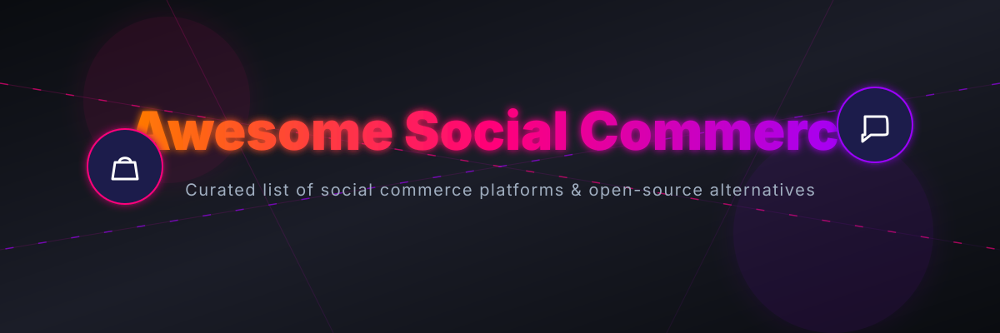

# Awesome-Social-Commerce-Platform

  

  

## 🛍️ Similar Projects to Social Commerce Platforms

> A curated list of awesome social commerce platforms, headless e-commerce, live shopping (livestream commerce), creator storefronts, and open-source alternatives.

**Social Commerce Platforms** enable shopping experiences driven by social interactions — influencer storefronts, affiliate links, live shopping/livestream commerce, shoppable video, comment-based selling, and social discovery. Leading commercial platforms include ShopMy, LTK (LikeToKnow.it), Spring by Amaze, Popshop Live, Whatnot, CommentSold, Firework, Flip.shop, ShopThing, and LiSA.

Below is a **curated list** of notable platforms and their open-source equivalents. Fully featured open-source alternatives that combine influencer networks, live auction/shopping, and social discovery at commercial scale are rare. The strongest options are modern headless e-commerce platforms, live-commerce systems, and marketplace frameworks that can be extended with social and live features.

---

## 🗺️ Table of Contents
- [SaaS / Hosted Platforms](#-saas--hosted-platforms)
- [Open-Source Software](#-open-source-software)
  - [Modern Headless / API-First E-Commerce](#-modern-headless--api-first-e-commerce-best-foundations)
  - [Live Shopping & Social Commerce Oriented](#-live-shopping--social-commerce-oriented)
  - [Marketplace & Social Platforms](#-marketplace--social-platforms)
  - [Supporting Open-Source Building Blocks](#-supporting-open-source-building-blocks)
- [Typical Open-Source Approach](#-typical-open-source-approach)
- [How to contribute](#how-to-contribute)
- [License](#license)

---

## 🏢 SaaS / Hosted Platforms

| Platform | Description | Pricing | Free Tier / Limit | Size (Est. Valuation / Revenue) |
|---|---|---|---|---|
| **[Whatnot](https://www.whatnot.com/)** | Live shopping and auction marketplace popular for collectibles and community-driven commerce. | ~8% commission fee (varies by category, e.g. 5% electronics, 4% coins) + 2.9% + $0.30 processing fee | Free to list and stream (No monthly base subscription fee) | **$11.5 - $20 Billion** (Valuation) |
| **[LTK (LikeToKnow.it)](https://www.liketoknow.it/)** | Leading influencer marketing and social commerce platform for creators to share shoppable content and earn commissions. | Free for creators (Brand subscriptions are custom/enterprise-only) | Free (requires approval, min. 5,000 followers and consistent posting) | **$2.0 Billion** (Valuation) |
| **[ShopMy](https://shopmy.us/)** | Influencer storefront and affiliate commerce platform. | Free for creators (Brands pay a subscription fee starting at ~$399/mo + transaction fees) | Free (application-based, typically requires min. 1,000 followers) | **$1.5 Billion** (Valuation) |
| **[Firework](https://www.firework.com/)** | Shoppable video and live commerce platform. | Starter: ~$39/mo (up to 10k views, 50 uploads) Growth: ~$259/mo (up to 100k views) Enterprise: Custom pricing | Yes, Pilot plan is free (up to 1,000 video views/mo, 10 uploads) | **$750 Million** (Valuation) |
| **[Popshop Live](https://www.popshop.live/)** | Live shopping and social commerce platform. | 6% commission fee on sales + 3% payment processing fee | Free to list and stream (No monthly base subscription fee) | **$100 Million** (Valuation) |
| **[LiSA](https://lisa.commerce/)** | Specialized social commerce, live shopping, or creator-focused platform. | Custom enterprise pricing (contact for demo/quote) | None (Sales-gated enterprise model) | **$74.9 Million** (Valuation est.) |
| **[CommentSold](https://www.commentsold.com/)** | Social selling platform that turns social media comments and live streams into sales (especially strong for Facebook/Instagram selling). | Starter: ~$149/mo + 5% commission Small Business: ~$499/mo + 4% commission Large Business: ~$999/mo + 3% commission | 15-day free trial (subscription fee waived, but commission still applies) | **$40.9 Million** (Valuation est.) |
| **[ShopThing](https://www.shopthing.com/)** | Specialized social commerce, live shopping, or creator-focused platform. | 10% transaction fee + 3.5% payment processing fee | Free to list and use (No monthly base subscription fee) | **$10 Million** (Funding) |
| **[Spring by Amaze](https://www.spring.com/)** | Social commerce and creator storefront solution. | Free to use (Uses base cost model where creators earn the markup profit above base product cost) | Free (no subscription tiers) | **$2.25 Million** (Market Cap) |
| **[Flip.shop](https://flip.shop/)** | Specialized social commerce, live shopping, or creator-focused platform. | *Platform has shut down* | *Platform has shut down* | **$0** (Shut down) |

## 🔓 Open-Source Software

### ⚡ Modern Headless / API-First E-Commerce (Best Foundations)
- **[Medusa](https://github.com/medusajs/medusa)**  — Extremely popular open-source headless commerce platform (Node.js/TypeScript). Highly extensible — excellent base for building custom social commerce, creator storefronts, or marketplace experiences.
- **[Saleor](https://github.com/saleor/saleor)**  — GraphQL-first open-source e-commerce platform. Strong for composable commerce and custom storefronts.
- **[Spree Commerce](https://github.com/spree/spree)**  — Mature open-source e-commerce platform with solid marketplace and multi-vendor capabilities.
- **[Vendure](https://github.com/vendure-ecommerce/vendure)**  — Modern TypeScript headless commerce framework designed for customization and multi-channel selling.

### 🎥 Live Shopping & Social Commerce Oriented
- Open-source **live shopping / livestream e-commerce** systems (primarily from Chinese open-source communities, e.g., Wanyue and similar projects). These often include multi-merchant support, live streaming with product showcasing, host/affiliate distribution, and short-video commerce features. Many are fully open-source for learning and non-commercial use, with commercial licenses available.
- Community projects that combine e-commerce backends with WebRTC or third-party live streaming for shoppable live experiences.

### 🤝 Marketplace & Social Platforms
- Open-source marketplace frameworks (built on Medusa, Saleor, Spree, or custom) that support multi-vendor selling and can be extended with social feeds or creator profiles.
- Self-hosted social network platforms that include marketplace modules (e.g., platforms offering posts + buy/sell listings).

### 🧱 Supporting Open-Source Building Blocks
- **Live streaming**: Use open-source media servers (e.g., MediaMTX, OvenMediaEngine) or WebRTC solutions together with an e-commerce backend.
- **Affiliate / creator tools**: Custom commission and tracking systems built on top of Medusa/Saleor + a simple creator portal.
- **Shoppable video**: Combine video players with product hotspots using open-source frontends.

### 🛠️ Typical Open-Source Approach
1. **Commerce engine** — Medusa, Saleor, or Vendure
2. **Storefront / creator shops** — Next.js, Remix, or custom React/Vue frontends
3. **Live features** — Integrate open-source or self-hosted live streaming + real-time chat
4. **Social layer** — Activity feeds, follows, and content modules (or integrate with ActivityPub/Mastodon-style networks)
5. **Payments & affiliates** — Stripe Connect or similar for multi-party payouts

This stack gives full ownership of customer data, no platform commissions on sales, and the flexibility to build influencer, live, or community-driven commerce experiences.

## Star History

<a href="https://www.star-history.com/?repos=ishandutta2007%2FAwesome-Social-Commerce-Platform&type=date&legend=bottom-right">
<picture>
<source media="(prefers-color-scheme: dark)" srcset="https://api.star-history.com/chart?repos=ishandutta2007/Awesome-Social-Commerce-Platform&type=date&theme=dark&legend=bottom-right" />
<source media="(prefers-color-scheme: light)" srcset="https://api.star-history.com/chart?repos=ishandutta2007/Awesome-Social-Commerce-Platform&type=date&legend=bottom-right" />

</picture>
</a>

---

**How to contribute**  
Fork this repository, add a new project (with link + short description + category), and open a pull request.  
Prefer actively maintained open-source projects related to social commerce, live shopping, creator storefronts, or headless e-commerce that can support social selling.

**License**  
This list is public domain / CC0. Feel free to copy into your own awesome list or README.

Star the projects you find useful — open commerce tools empower creators and merchants to own their social shopping experiences! 🛍️
